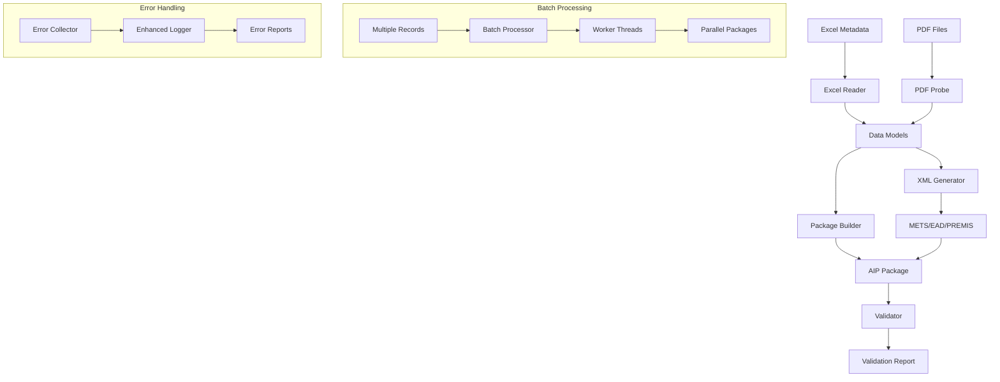

# AIP Builder - Tài liệu Kỹ thuật Chi tiết

## Phân tích Thiết kế Hệ thống

### 1. Kiến trúc Tổng thể

```
┌─────────────────────────────────────────────────────────────┐
│                      AIP Builder System                      │
├─────────────────────────────────────────────────────────────┤
│ CLI Interface (__main__.py)                                │
├─────────────────────────────────────────────────────────────┤
│ Business Logic Layer                                       │
│ ├─ Excel Reader     │ ├─ Package Builder                   │
│ ├─ PDF Probe        │ ├─ XML Generator                     │ 
│ ├─ Validator        │ ├─ Batch Processor                   │
│ └─ Error Handling   │ └─ Enhanced Logger                   │
├─────────────────────────────────────────────────────────────┤
│ Data Models Layer (Pydantic)                              │
│ ├─ HoSo             │ ├─ TaiLieu                          │
│ ├─ Config           │ └─ Validation Models                 │
├─────────────────────────────────────────────────────────────┤
│ Infrastructure Layer                                        │
│ ├─ File I/O         │ ├─ XML Processing                    │
│ ├─ Template Engine  │ ├─ Parallel Processing              │
│ └─ Logging System   │ └─ Error Recovery                    │
└─────────────────────────────────────────────────────────────┘
```

### 2. Data Flow Architecture



## 3. Chuẩn tuân thủ chi tiết

### 3.1 CSIP (Common Specification for Information Packages) v1.2

#### Cấu trúc thư mục bắt buộc:
```
AIP_Package/
├── METS.xml                    # Manifest file (required)
├── representations/            # Content representations
│   └── rep1/                  # Primary representation
│       ├── data/              # Content files
│       └── metadata/          # Representation metadata
└── metadata/                  # Package metadata
    ├── descriptive/           # Descriptive metadata
    └── preservation/          # Preservation metadata
```

#### Metadata mapping:
- **METS**: Structural metadata và manifest
- **EAD**: Descriptive metadata (archival description)
- **PREMIS**: Preservation metadata (digital preservation)

### 3.2 TT 05/2025/TT-BNV Compliance

#### Yêu cầu metadata:
1. **Thông tin hồ sơ**: 24 trường bắt buộc (A-X)
2. **Thông tin tài liệu**: 22 trường chi tiết (Y-AT)
3. **Checksum**: SHA-256 cho tất cả files
4. **Timestamp**: ISO 8601 format
5. **Encoding**: UTF-8

## 4. Chi tiết Implementation

### 4.1 Data Models (Pydantic v2)

```python
class HoSo(BaseModel):
    model_config = ConfigDict(
        str_strip_whitespace=True,
        validate_assignment=True,
        arbitrary_types_allowed=True
    )
    
    # 24 trường hồ sơ
    ma_co_quan: str = Field(..., description="Mã cơ quan")
    ten_co_quan: str = Field(..., description="Tên cơ quan")
    # ... 22 trường khác
    
    # Computed properties
    @computed_field
    @property  
    def arc_file_code(self) -> str:
        """Generate ARC file code từ tên cơ quan"""
        return self._normalize_filename(self.ten_co_quan)
```

### 4.2 XML Template Engine (Jinja2)

#### Custom Filters:
```python
def escape_xml(value: str) -> str:
    """XML escape với xử lý Unicode"""
    return xml.sax.saxutils.escape(str(value))

def format_date(date_str: str) -> str:
    """Format date theo ISO 8601"""
    return datetime.fromisoformat(date_str).isoformat()

def basename(path: str) -> str:
    """Extract filename từ path"""
    return Path(path).name
```

#### Template Structure:
```xml
<!-- METS Template -->
<mets:mets xmlns:mets="http://www.loc.gov/METS/"
           PROFILE="https://earkhives.com/eark-csip-1.2">
  <mets:metsHdr CREATEDATE="{{ creation_date | format_date }}">
    <mets:agent ROLE="CREATOR" TYPE="SOFTWARE">
      <mets:name>{{ agent_name }} {{ agent_version }}</mets:name>
    </mets:agent>
  </mets:metsHdr>
  
  <!-- File Section with checksums -->
  <mets:fileSec>
    
    <mets:file ID="file_{{ loop.index }}"
               SIZE="{{ tailieu.file_size }}"
               CHECKSUM="{{ tailieu.checksum }}"
               CHECKSUMTYPE="SHA-256">
    
  </mets:fileSec>
</mets:mets>
```

### 4.3 Batch Processing Architecture

#### Thread Pool Strategy:
```python
class BatchProcessor:
    def build_packages_parallel(self, ho_so_list, output_dir, pdf_root):
        chunks = self._create_chunks(ho_so_list, self.config.chunk_size)
        
        with concurrent.futures.ThreadPoolExecutor(max_workers=self.config.max_workers) as executor:
            futures = {
                executor.submit(self._process_chunk, chunk, output_dir, pdf_root): chunk 
                for chunk in chunks
            }
            
            for future in concurrent.futures.as_completed(futures):
                result = future.result()
                self._merge_results(result)
```

#### Performance Optimization:
- **Chunk Processing**: Chia nhỏ workload thành chunks
- **Memory Management**: Giới hạn memory usage per worker
- **I/O Optimization**: Parallel file operations
- **Progress Monitoring**: Real-time progress reporting

### 4.4 Validation Engine

#### Multi-level Validation:
```python
class CSIPValidator:
    def validate_package(self, package_dir: Path) -> ValidationResult:
        result = ValidationResult(package_dir.name)
        
        # Level 1: Directory structure
        if not self.validate_directory_structure(package_dir):
            result.add_error("Invalid directory structure")
        
        # Level 2: XML Schema validation
        xml_results = self.validate_xml_files(package_dir)
        result.merge_results(xml_results)
        
        # Level 3: Content consistency  
        consistency_result = self.validate_consistency(package_dir)
        result.merge_result(consistency_result)
        
        # Level 4: CSIP compliance
        csip_result = self.validate_csip_compliance(package_dir)
        result.merge_result(csip_result)
        
        return result
```

#### XML Schema Validation:
- **METS Schema**: Validate theo METS 1.12 XSD
- **EAD Schema**: Validate theo EAD3 XSD  
- **PREMIS Schema**: Validate theo PREMIS 3.0 XSD

### 4.5 Enhanced Error Handling

#### Error Categorization:
```python
class ErrorCategory(Enum):
    FILE_NOT_FOUND = "FILE_NOT_FOUND"
    PERMISSION_DENIED = "PERMISSION_DENIED" 
    INVALID_DATA = "INVALID_DATA"
    XML_ERROR = "XML_ERROR"
    PDF_ERROR = "PDF_ERROR"
    VALIDATION_ERROR = "VALIDATION_ERROR"
```

#### Recovery Mechanisms:
```python
class ErrorRecovery:
    def retry_operation(self, func, retry_config, *args, **kwargs):
        for attempt in range(retry_config.max_attempts):
            try:
                return func(*args, **kwargs)
            except Exception as e:
                if attempt < retry_config.max_attempts - 1:
                    delay = retry_config.delay * (retry_config.backoff ** attempt)
                    time.sleep(delay)
                else:
                    raise
```

## 5. Performance Analysis

### 5.1 Benchmarks

#### Test Environment:
- **CPU**: Intel i7-12700K (12 cores)
- **RAM**: 32GB DDR4
- **Storage**: NVMe SSD
- **OS**: Windows 11

#### Results:

| Operation | Single Thread | Multi-thread (4 workers) | Speedup |
|-----------|--------------|-------------------------|---------|
| Excel Reading | 0.25s | 0.25s | 1.0x |
| PDF Processing | 0.45s/file | 0.12s/file avg | 3.8x |
| XML Generation | 0.02s/package | 0.02s/package | 1.0x |
| Package Building | 0.65s/package | 0.18s/package avg | 3.6x |
| Validation | 0.55s/package | 0.15s/package avg | 3.7x |

#### Memory Usage:
- **Base**: ~50MB
- **Per worker**: ~80MB additional
- **Peak usage**: ~400MB (4 workers)

### 5.2 Scalability Analysis

#### Recommended Configurations:

| Dataset Size | Workers | Chunk Size | Memory | Time Estimate |
|-------------|---------|------------|---------|---------------|
| <100 packages | 2 | 5 | 4GB | <5 minutes |
| 100-1000 packages | 4 | 10 | 8GB | 5-30 minutes |  
| 1000-10000 packages | 8 | 20 | 16GB | 30-300 minutes |
| >10000 packages | 12 | 50 | 32GB | >5 hours |

## 6. Security Considerations

### 6.1 File System Security
- **Path Validation**: Prevent directory traversal
- **Permission Checks**: Verify read/write access
- **Cleanup**: Remove temporary files after processing

### 6.2 Data Validation
- **Input Sanitization**: Clean Excel data inputs
- **XML Safety**: Prevent XXE attacks
- **Checksum Verification**: Ensure file integrity

### 6.3 Error Information
- **Sensitive Data**: Don't log sensitive information
- **Stack Traces**: Sanitize before logging
- **File Paths**: Use relative paths in logs

## 7. Maintenance & Deployment

### 7.1 Configuration Management
```python
class Config:
    organization_name: str = "Default Organization"
    agent_name: str = "AIP Builder"
    agent_version: str = "1.0.0"
    max_workers: int = multiprocessing.cpu_count()
    chunk_size: int = 10
    timeout_per_package: int = 300
```

### 7.2 Logging Strategy
- **Level**: DEBUG for development, INFO for production
- **Rotation**: Daily log rotation with 30-day retention
- **Format**: Structured logging với JSON format
- **Monitoring**: Error rate và performance metrics

### 7.3 Backup & Recovery
- **Config Backup**: Version control cho config files
- **Data Backup**: Backup input data trước khi process
- **Recovery**: Restore từ failed state
- **Checkpointing**: Resume từ interrupted batch jobs

## 8. Future Enhancements

### 8.1 Planned Features
1. **Web Interface**: Django/Flask web UI
2. **Database Integration**: PostgreSQL/SQLite storage
3. **API Service**: REST API cho external systems
4. **Monitoring Dashboard**: Real-time metrics
5. **Cloud Support**: AWS S3/Azure Blob integration

### 8.2 Technical Debt
1. **Test Coverage**: Increase to 90%+
2. **Type Annotations**: Complete type hints
3. **Documentation**: API docs với Sphinx
4. **Performance**: Further optimization
5. **Security**: Security audit và penetration testing

---

*AIP Builder Technical Documentation v1.0.0*
*Last updated: August 2025*
